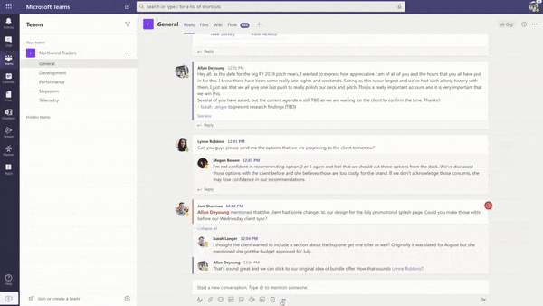

# Poll App Template

Poll is a custom [Teams message extension](https://docs.microsoft.com/en-us/microsoftteams/platform/messaging-extensions/what-are-messaging-extensions) app that enables users to quickly create and send polls in a chat or a channel to know their team’s opinion. Use this template in Meetings along with group and channels. Poll app is supported across all platforms – Teams desktop, browser, iOS, and Android clients. It is built on Microsoft 365 Action platform (an extension of [Kaizala Action platform](https://docs.microsoft.com/en-us/kaizala/developer-platform))

* [Solution overview](Solution-overview.md)
* Deploying the app
    * [Deployment guide](Deployment-guide.md)